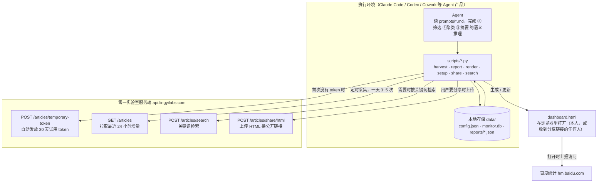
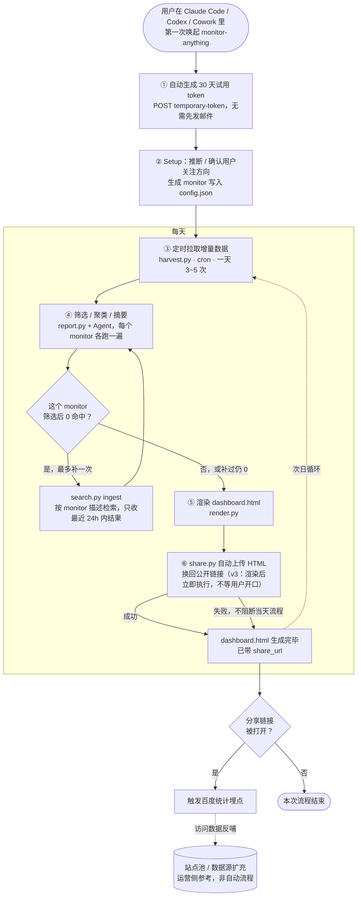

# ARCHITECTURE

面向想了解实现细节的读者。这里说明的是**为什么**这么设计，不是逐行讲代码——代码本身
有类型注解和 docstring，具体实现直接看 `scripts/` 即可。

## 1. 核心方法论：小量级数据不需要算法工程

这个项目每天处理的数据量在 300 条以内，筛选后进入聚类的幸存者通常是 40~80 条。这个规模
放在十年前的信息检索语境里会自然地导向：写关键词规则、上 TF-IDF、上传统聚类算法（K-Means /
层次聚类）、可能还要上向量数据库做检索。

**这些方案在这个数据量级上是不必要的，而且效果更差。** 具体表现：

- **筛选**：用户描述关注方向是一句自然语言（"关注国内 AI 推理基础设施……不关心融资八卦"），
  关键词规则覆盖不了语义层面的排除意图（比如没提到"招聘"字样但确实是招聘软文）。LLM 直接读
  懂这句话，比维护一套不断增长的正则规则划算得多。
- **聚类**：判断"这几篇文章在讲同一件事"本质上是语义理解 + 常识推理（同一实体、同一时间窗、
  细节能对上），传统聚类算法需要先做特征工程（embedding、相似度阈值调参），而且效果高度依赖
  阈值选择——阈值稍微调低就把不相关的文章合并到一起，调高就漏掉措辞不同但讲同一件事的报道。
  LLM 一次性把这两类错误都控制得更好，因为它能读正文、看细节，而不是只算向量距离。
- **摘要**：摘要天然是生成任务，没有"传统方案"可选。

数据量是这个判断成立的前提——300 条标题一次性喂给 LLM 只有几万 token，一两次调用就能处理完；
如果是百万级数据，这个账就要重新算。**这个项目明确不追求处理更大数据量**（见 SKILL.md 的
非目标），所以不需要为了"未来可能要扩展"而提前上向量检索或聚类算法的复杂度。

## 2. 为什么脚本与 Agent 严格分工

采集（①）与清洗（②）是确定性操作：请求接口、去重、正则清洗、写数据库——每一步都有明确
的对错，不需要语义判断，也不应该依赖 LLM（慢、贵、还可能出幻觉篡改原文）。这两步做成纯
Python 脚本 `harvest.py`，可以挂 cron 无人值守运行。

筛选（③）、聚类（④）、摘要（⑤）需要语义理解，交给 Agent（也就是执行这个 Skill 的 Claude）
直接推理完成，而不是脚本去调用某个外部 LLM API。这带来两个好处：

1. **不需要用户额外配置 LLM API key**——Agent 本身就是有语言理解能力的执行者，读
   `prompts/*.md` 里的说明后直接完成任务，输出结果写成 JSON 文件。
2. **零依赖原则不被破坏**——如果脚本自己要调用 LLM API，就得引入 HTTP 客户端库处理复杂的
   流式响应、重试、限流，而这些复杂度对"零技术背景用户能跑起来"这个目标没有任何帮助。

`scripts/report.py` 的四个子命令（`candidates` → `filtered` → `clustered` → `summarized`）
构成一条流水线，每一步都是"脚本准备干净的输入数据 → Agent 语义处理 → 脚本接收结果并组装
下一步的输入"。这也是为什么代码里没有一个统一的"跑完整个 pipeline"入口函数——中间必须让
Agent 介入，脚本自己没法端到端跑完。

## 3. 为什么采集与报告解耦成两个独立脚本

数据源接口**不支持历史回溯，只返回滚动的最近 24 小时**。这意味着任何一次漏跑都是永久性的
数据丢失，无法补救。

如果把采集和报告生成绑在一起（比如"每天 Agent 被唤起时才顺便抓一次数据"），采集就会依赖
Agent 在场——而 Agent 什么时候被唤起是不确定的（用户可能今天没打开 Claude Code）。所以：

- **`harvest.py` 独立运行，建议一天触发几次（默认 0/6/12/18 点），不依赖任何语义推理。**
  24 小时窗口配 4 次/天的频率，相当于 4 倍冗余，单次漏跑不会丢数据。
- **`report.py` 的语义阶段由 Agent 每日触发或用户手动唤起**，因为这部分必须有 Agent 在场
  才能完成，但即使某天没有生成报告，`harvest.py` 抓到的数据依然完整保存在 `monitor.db` 里，
  之后随时可以补跑报告。

**v3：两者都不再挂系统级 cron / launchd / schtasks，改成由 Agent 在 Setup 时调用宿主平台
自己的定时任务能力，创建两条独立的定时任务**（一条只跑 `harvest.py run`、一条跑完整的
③~⑥）。放弃系统级 cron 这条路径的原因：即使只让它调度 `harvest.py`（零语义推理、看起来
最安全的那部分），也是"一个陌生脚本自己修改用户的系统 crontab / launchd 配置"，仍然不是
应该在用户不知情的情况下发生的事；而"报告"这一半反正必须靠 Agent 在场才能触发，与其维护
两套调度机制（系统级 cron 管采集、Agent 唤醒管报告），不如统一交给 Agent 平台自己的调度
能力管理——如果宿主平台不提供这种能力，如实告诉用户做不到全自动，而不是退回去用系统级
cron 只自动化一半。

## 4. 去重策略：为什么两层去重、为什么按 fetched_at 清理

**两层去重**：
1. **主键去重**（`id`）：接口保证 `id` 跨请求稳定，同一篇文章被抓到两次时 id 相同，这是最
   可靠也最便宜的去重手段，优先做。
2. **URL 去重**（剥离追踪参数后哈希）：公众号文章经常被多个账号转载同一篇内容，转载后的
   `id` 不同，但如果保留了原始链接（哪怕带着 `chksm=` / `scene=` / `from=` 这些微信自动附加
   的追踪参数），剥离参数后的 URL 是一样的。这一层专门解决"同一篇内容、不同 id"的情况。

**为什么按 `fetched_at` 而不是 `publish_time` 做过期清理**：公众号存在"旧文重推"的情况——
一篇三个月前发布的文章今天被重新推送，`publish_time` 还是三个月前，但 `fetched_at` 是今天。
如果按 `publish_time` 清理，这类文章可能前脚刚抓到、后脚就因为"发布时间超过 30 天"被删除，
用户永远看不到。按 `fetched_at` 清理保证的语义是"进来的东西至少完整保留 N 天"，这才是用户
实际期望的行为。

## 5. Schema 相对 §5.2 规格文档的两处小扩展

实现过程中在原始表结构基础上加了两处字段/机制，都是为了让 §6 六阶段的信息能完整传递到
HTML 展示层，记录在这里避免后来者困惑：

- **`articles.low_quality` 列**：清洗阶段（②）判定的"噪音降权"标记（标题命中硬排除词，
  或正文过短且无摘要兜底）需要传递给筛选阶段（③）参考，但规格文档给出的 schema 里没有
  承载这个信息的字段，所以加了这一列。降权不等于删除——是否真正剔除仍由 Agent 在筛选阶段
  综合判断，这一列只是提供额外信号。
- **`monitor.filter_examples` 字段**：HTML 的"AI 筛选实例"区块（展示 2~3 条保留/排除的
  具体案例）需要筛选阶段产出的原始判断依据，这个字段由 `prompts/filter.md` 要求 Agent 在
  筛选结果 JSON 里一并给出，`report.py` 原样透传进最终报告 JSON。

## 6. 终端进度展示的一个真实限制

§8 要求六阶段进度表"原地刷新"。这在 `harvest.py`（① ② 两阶段，单进程内完成）是可以做到的，
用 `\r` 真正原地覆盖同一行。

但 `report.py` 的 ③④⑤ 三个阶段之间必须等 Agent 完成语义推理——而 Agent 推理发生在两次
`report.py` 调用之间，脚本进程早已退出。**没有办法在已经退出的终端会话里做光标复位**，所以
`report.py` 每次被调用时会重新打印一张完整的六阶段表，数字比上一次更新。在终端里的直观效果
是表格随进度不断刷新覆盖，虽然不是字面意义上的单帧原地刷新，但达到了同样的目的：用户能
实时看到数字在变化，而不是盯着一屏 log 刷屏。

## 7. 报告 JSON 是唯一权威产物

`reports/<date>.json` 是 ⑥ 之前所有阶段结果的最终落点，`share.py` 上传换回来的公开链接
（写回同一份 JSON 的 `share_url` 字段）也只读/只写这一份 JSON，不重新调用 LLM、不重新
查询数据库。这保证了同一天的报告在不同产出形式里呈现的信息是完全一致的（v2 之前这里还
提到过"以后可能支持邮件/企业微信推送"，v2 已经把那条可插拔扩展层去掉了，见 §16，产出
路径明确只保留 HTML 这一条）。

**v3 起从这份 JSON 渲染出的 HTML 产物拆成了两类，见 §15**：`reports/<date>.html`——每天
一份，只由**这一天**的 JSON 渲染而成，不再像 v2 那样把最近 30 天的历史一起塞进同一份
HTML；以及一份不再由 JSON 驱动的静态首页 `reports/dashboard.html`，只在首次运行时生成，
之后固定不变。

## 8. 多 monitor 场景下的统计口径

`fetched` / `after_dedup` / `sources` 是采集清洗阶段的全局值，与具体 monitor 无关。
`after_prefilter` / `after_llm_filter` / `clusters` / `selected` 是按 monitor 各自独立
计算的（不同 monitor 的 `exclude_keywords` / `mute_feeds` / `min_score` 不同），`report.py`
在每个 monitor 处理完后把它们求和，作为顶层漏斗展示的数字。这意味着如果配置了多个 monitor，
顶层"筛选"漏斗里的数字是"所有 monitor 命中数之和"，而不是去重后的独立文章数——同一篇文章
如果同时命中两个 monitor，会在这个求和里被计两次。这是有意的取舍：漏斗要展示的是"系统为
你的每个关注方向分别做了多少工作"，而不是一个跨 monitor 去重后的抽象数字。

## 9. Dashboard 对齐 Claude Design 交付稿：per-monitor 视角（decision 开关已在 v3 移除，见文末）

`assets/template.html` / `scripts/render.py` 在某次改版中对齐了一版 Claude Design（design
mode）产出的交付稿，从"所有 monitor 拼一个长页面"改成"按 monitor 切换 tab，每个 tab 独立
展示自己的漏斗与今日动态"。这带来两处 schema 上的变化，记录在这里避免后来者困惑：

- **`monitor_report.stats`**：`report.py` 的 `cmd_summarized` 之前只把 `after_prefilter` /
  `after_llm_filter` / `clusters` / `selected` 这几个计数写进临时的 run-state（`.work/state-<date>.json`，
  跨进程调用之间用来反推 stage_ms 耗时），最终落盘的 `reports/<date>.json` 里每个 monitor
  小节并不包含这些数字——只有顶层 `report.stats` 有一份"所有 monitor 求和"后的聚合值（见
  §8）。新版 dashboard 需要每个 monitor 各自的漏斗（因为 tab 切换时数字要跟着变），所以
  `cmd_summarized` 现在把这几个数字额外复制一份写进 `monitor_report.stats`，作为该 monitor
  独立的漏斗计数。①②两阶段（`fetched`/`after_dedup`）本来就是全局值，不受 monitor 影响，
  渲染时仍然从顶层 `report.stats` 取，不需要在每个 monitor 里重复。
- **`output_kind` / `advice`（决策型 monitor）：v3 已完全移除**：交付稿里原本设想过一个
  "决策型" monitor 变体（`output_kind: "decision"`），dashboard 上多展示一个"今日结论"
  区块，列出 AI 判断"该做什么、什么时候做"外加置信度和信号依据。这需要新的语义判断（不是
  简单的格式转换），意味着要新写一版 `prompts/decision.md` 和配套的 `report.py` 子命令，
  工作量与筛选/聚类/摘要相当，属于独立的功能，早期版本一直没有完成，只留了
  `monitor_report.output_kind`（恒为 `"digest"`）、`advice`（恒为空数组）这两个没有实际
  内容的占位字段，以及 `assets/template.html` 里从未被真正触发过的"今日结论"渲染分支。
  安全/质量审计中把这个半成品功能判定为未完成的产品契约缺口——字段存在但从不产生内容，
  容易让人误以为功能已经实现。v3 里直接删掉了这些占位：`report.py` 不再计算或写出
  `output_kind`/`advice`/`OUTPUT_LABELS`，`template.html` 里对应的 `OUTPUT_KIND_STYLE`、
  `buildAdvice()`、`.advice-*`/`.focus-kind*` 样式和渲染分支也一并删除。真要支持决策型
  monitor，需要从头写 `prompts/decision.md` 和配套渲染逻辑，不是恢复这些占位字段。

同时，旧版 dashboard 里的"数据资产总览"（`monitor.db` 里全量留存的语料统计）和"7天采集
趋势图"两个区块被去掉了——交付稿里没有对应的位置，且这两块本来就是"系统这些天攒了多少
东西"这种运营视角的信息，跟"今天你关注的方向发生了什么"这个核心叙事关系不大，去掉后
`render.py` 也不再需要连接 `monitor.db`（reports/<date>.json 就是渲染所需的全部输入，见
§7）。**多日期的历史切换后来在 v3 里也被去掉了**——不是这次改版的决定，而是 §7 描述的
"每天一个独立 HTML 文件 + 固定不变的首页目录"架构调整的一部分：单个 `<date>.html`
不再包含日期切换的 JS/state，"回看最近几天"改成从静态首页 `dashboard.html` 点进对应
日期的文件，详见 §7 和 §12。

## 10. v2：token 获取从"先发邮件"改成"自动试用"

第一版实测下来，"装完之后要先发邮件等人工发 token 才能看到效果"是最致命的流失点——用户
在真正看到这个 Skill 能做什么之前就要先等一封邮件回复，大部分人等不到这一步就走了。

v2 把这一步换成了自助：`setup.py check-token` 在发现没有 token 时，直接 POST
`temporary-token` 接口，拿一个默认 30 天有效期的试用 token 并写入 `config.json`，全程不
需要用户做任何事。这个接口不需要携带鉴权信息——它是专门给全新用户设计的免排队入口，跟
"已有 token 但过期了"是两条不同的路径：

- **首次使用、没有 token** → 自动调用 `temporary-token`，全自动，不打断用户
- **token 过期或失效**（`check-token` 收到 401）→ **不会**自动再调一次 `temporary-token`
  换新 token，而是提示用户邮件联系 `TOKEN_HELP_EMAIL` 申请延长有效期

为什么过期后不直接再自动申请一个新的试用 token：试用 token 是留给"评估这个 Skill 值不值
得长期用"这个场景的一次性入口，如果过期后脚本自己就能无限续新的试用 token，这个额度控制
就形同虚设了。让"继续用"这个决定回到人工审核的邮件流程，是业务侧刻意设计的边界，不是技术
限制，所以客户端严格遵守，不去"聪明地"绕过它。

`common.token_expiry_note()` 在 token 距过期 ≤5 天时会在 `check-token` 的返回里附带一句
临期提醒，让 Agent 能提前告诉用户，而不是等真的 401 了才反应过来（那时候当天的采集窗口
可能已经错过，见 build-spec.md §13"失败告警"）。

## 11. v2：接口地址从裸 IP 切到域名

第一版接口地址是测试期的裸 IP（`8.130.106.19:8200`），现在正式切到域名
`https://api.lingyilabs.com`。规格文档 §3.1 早就预留了这个变化（"接口地址将来可能换成
域名 → 地址必须可配置，不要硬编码在多处"），所以这次改动只需要改 `common.py` 里的
`API_HOST` 一处常量——`base_url` / `TEMP_TOKEN_URL` / `SHARE_HTML_URL` 全部从它派生，
`config.json` 里已经写死旧地址的老用户，`load_config()` 不会强制覆盖用户配置里的
`base_url`（尊重用户可能出于某种原因手动改过的配置），但新装用户和 `setup.py` 自动写入
的默认值都会是新域名。

## 12. v2：HTML 分享——为什么上传逻辑不放进浏览器里的按钮点击事件

每天独立的报告页 `<date>.html`（v3 之前是唯一的产物 `dashboard.html`，见 §15）上一直有
一个"分享今日洞察"按钮（悬浮在页面右侧），v2 之前它只做本地能力：系统分享面板
（`navigator.share`）或者复制一段文案到剪贴板。这次要新增的能力是把这份 HTML 上传到
零一实验室的分享服务，换一个可以在浏览器直接打开、随意转发的公开链接（对应接口
`POST /api/data/articles/share/html`，把 HTML 文件以 `application/octet-stream` 作为
请求体上传，鉴权同样是 `Authorization: Bearer <token>`）。

这里有一个容易踩的坑：**`<date>.html` 本身就是会被分享出去的文件**（"单文件可分享，
双击即开，能直接发微信"是这个项目刻意保留的能力，见 §设计原则）。如果把上传请求写进它
的 `<script>` 标签里，就必须把一个能通过鉴权的 Bearer token 一起打包进这份到处转发的
静态文件——收到这个 HTML 文件的任何人，打开浏览器控制台或者直接看源码，就能拿到这个
token 并冒用发送者的额度。这和"token 只留在本地 `config.json`，从不离开用户机器"这条从
第一版就有的设计原则是直接冲突的。另外，这份 HTML 通常以 `file://` 方式打开，从
`file://` 页面向外发起跨域 POST 本身在很多浏览器里也会被拦截，不是一个可靠的技术路径。

所以 v2 把"上传"设计成一次**显式的、由 Agent 触发的脚本调用**（`scripts/share.py`），
而不是浏览器里的一次网络请求：

1. Agent 调用 `share.py upload --date <date>`（v2 里这一步等用户开口要分享才触发；v3 起
   改成渲染完就自动触发一次，谁来触发、什么时候触发变了，但"必须是 Agent/脚本，不能是
   浏览器 JS"这条边界没有变——详见 §20）
2. 脚本读本地 `config.json` 里的 token，把 `data/reports/<date>.html` 这一天的独立文件
   当作请求体 POST 给分享接口，拿到公开链接——**上传范围天生就只有这一天**，v3 起
   `dashboard.html` 不再内嵌任何一天的报告内容，也就不存在"上传时带出历史窗口"这回事了
3. 把链接写回 `reports/<date>.json` 的 `share_url` 字段，并重新跑一次 `render.py` 的
   单日渲染逻辑（复用 `render.render_day_html()`，不重新调 LLM，符合 §7"报告 JSON 是
   唯一权威产物"的既有原则；只重渲染这一天的文件，首页和清单不受影响）
4. 下次用户在浏览器里打开这份新渲染的 `<date>.html`，`REPORT_DATA.report` 里已经带着
   `share_url`，按钮点击时 `state.shareUrl` 非空，就会复制/分享这个真链接，而不是
   `location.href`（本地 `file://` 路径对收到消息的人没有任何意义，v2 之前这里其实是
   一个没有实际作用的伪功能）

分享接口目前返回结构未完全在文档里锁定，`share.py` 的 `extract_share_url()` 对
`url` / `share_url` / `html_url` / `link` 几种常见字段名做了兼容，并把原始返回值一并
打印出来，取不到已知字段时 Agent 可以直接读原始返回内容转述给用户，不会因为字段名猜错
就完全拿不到结果。

## 13. 系统架构图

静态视角：这个项目由三块组成——① 用户安装 Skill 的**执行环境**（Claude Code / Codex /
Cowork 等 Agent 产品，本地跑 `scripts/*.py` 和 Agent 的语义推理，数据落在本地 `data/`
目录）；② **零一实验室服务端**暴露的 4 个接口，全部挂在 `api.lingyilabs.com` 域名下；
③ **百度统计**这一个第三方分析服务，只在 `dashboard.html` 被打开时触发。三者之间没有
常驻连接，都是执行环境按需发起的一次性请求。



几个容易问到的点提前说明：

- **执行环境和服务端之间没有反向连接**——服务端不会主动推送数据给用户，所有请求都是
  执行环境发起的一次性 HTTP 调用，符合零依赖脚本"确定性网络请求"的定位（见 §2）。
- **`dashboard.html` 一旦生成/分享出去，就脱离了执行环境**——它是个独立的静态文件，图里
  单独画成一个节点，而不是挂在 `ENV` 子图里，就是要强调这一点：收到分享链接的人打开它时，
  触发的是"浏览器 → 百度统计"这一条边，跟执行环境、跟发布者的本地机器都没有关系。
- **百度统计不是四个业务接口之一**，是单独接进来的第三方分析服务，对应 §"零 CDN/可离线"
  原则里唯一的例外（见前面模板改动的说明）。

## 14. 核心业务流程图

动态视角：一次完整的用户旅程，以及"每天"这个循环节奏里发生了什么。v2 这一版把"补充
检索"从早期草图里的"概念性、按需触发的旁支"改成了**④内部真实会自动跑的一步**——只在
某个 monitor 筛选后 0 命中时触发，且最多补一次，见 §18 的详细说明。v3 起⑥分享也从"用户
选择分享"这个决策节点变成了每天渲染之后必然执行的一步，不再是图里的可选分支，具体取舍
见 §20。图里仍然保留了一处概念性信号：分享链接被打开之后的"反哺"，那部分（要不要因为
访问数据/检索到的长尾话题给站点池加新渠道）是运营侧的产品决策，不是这个 Skill 里任何
脚本会自动执行的流程。



跟 §13 对照着看：①②只发生一次（Setup 阶段），③④⑤是每天重复的循环（对应 §3 里
"采集与报告解耦"的设计——④内部的补充检索也在这个循环里，不需要额外的调度），⑥是可选的、
由用户按需触发的分支，不在每日循环里强制发生。

## 15. v2 曾经：dashboard 历史窗口跟磁盘保留期统一；v3：彻底改了产出模型

**v2 的做法（已废弃，以下是历史背景）**：`render.py` 生成唯一的产物 `dashboard.html`，
把最近 N 天的 `reports/*.json` 全部内嵌进同一份 HTML，靠浏览器里的日期切换器在同一个
页面内切换。这个 N 一开始跟磁盘上的实际保留期（`retention.reports_days`，默认 30 天）
是两个互不相干的硬编码数字（`render.py` 顶部写死 `HISTORY_DAYS = 7`），导致"文件在磁盘
上还留着，但 dashboard 里翻不到"——v2 后期把这两个数字统一成同一个来源，修掉了这个体验
缺陷，但没有解决更根本的问题：**这份 HTML 只要被分享出去，收到的人就能看到内嵌的全部
历史天数和全部 monitor**，分享范围和分享意图完全对不上。

**v3 的做法**：不再有"一份 HTML 内嵌 N 天历史"这种产物了。`render.py` 现在每天只产出
`reports/<date>.html`——只由这一天的 JSON 渲染而成，不内嵌任何其他日期的数据，分享它
就是分享这一天，不存在"意外带出历史"的问题。回看历史的能力换了个实现方式：一份固定不变
的静态首页 `reports/dashboard.html`，配合每次运行都会重新生成的 `reports/dates-manifest.js`
（只有日期 + 每个 monitor 的名字/精选条数，不含标题/摘要/正文）。首页通过
`<script src="dates-manifest.js">` 在打开时读取最新清单，点日期是普通的页面跳转到对应
的 `<date>.html`，不是 JS 状态切换——不需要服务器，双击也能正常工作。首页本身不含任何
报告内容，因此哪怕首页本身被误转发，也不会像 v2 那样泄露历史数据。

v2 把这两个数字合并成一个来源：`render.py` 的 `main()` 和 `share.py` 的 `cmd_upload()`
现在都从 `cfg["retention"]["reports_days"]` 读取窗口天数，传给 `load_recent_reports()`，
不再用写死的常量（`render.py` 里保留了 `DEFAULT_HISTORY_DAYS = 30`，只是没有 `config.json`
时的兜底值，跟 `DEFAULT_CONFIG` 里 `reports_days` 的默认值保持一致）。现在的语义很直接：
**磁盘上留多久，dashboard 里就能翻多久，不会再出现两个数字打架的情况。**

## 16. v2：移除可插拔扩展输出层，只保留 HTML 分享一条路

第一版规格文档设计了一个 `outputs/` 目录，作为"扩展输出层"：`email.py`（SMTP 发邮件）、
`webhook.py`（飞书/企微/钉钉机器人推送），配套 `_contract.md` 定义 `emit(report, config)`
接口，`config.json` 顶层的 `outputs` 数组用来声明启用哪些渠道。这是第一版就标注为"第二阶段
能力，不阻塞主流程"的东西。

实测下来发现一个问题：这一层从来没有真正被接起来过。`report.py` / `render.py` 里没有任何
代码会读取 `cfg["outputs"]`、发现里面有 `"email"` 就自动 import `outputs/email.py` 并调用
`emit()`——唯一的"调用入口"是 SKILL.md 里一段文字，指望 Agent 在用户开口要邮件推送时自己
临时写代码调一次。也就是说这个扩展层从第一版起就是**纯文档契约，没有配套的 dispatcher**，
一直是半成品状态。

v2 决定不补这个半成品，而是直接砍掉，只保留一条已经在真实工作的产出路径：

- **HTML dashboard**：`render.py` 无条件生成，本地文件，双击即开
- **HTML 分享链接**：`share.py` 上传换取公开链接（见 §12；v3 起改成渲染后自动触发，
  不再是"按需"，见 §20），这是唯一的"分发到本地文件之外"的方式

对应的改动：删掉整个 `outputs/` 目录（`_contract.md` / `email.py` / `webhook.py`）；
`config.json` 的 `DEFAULT_CONFIG` 不再有顶层 `outputs` 字段（`setup.py` 的 `init-config`
也不再写入这个字段）；SKILL.md 里"扩展输出"那一节改成一句话说明"目前只有 HTML 这一条路"。
如果以后真的要做邮件/群推送，重新引入时应该同时把 dispatcher 也写出来（比如 `report.py
finalize` 之后自动扫描 `cfg["outputs"]` 并调用对应 emitter），不要重复"只有文档、没有代码
兜底"的半成品状态。

## 17. 完整文件清单

以下是这个 Skill 目录里**现在实际存在的**每一个文件（不含 `__pycache__`、`.DS_Store` 这类
产物），以及各自的职责。`data/` 整个目录是运行时生成的本地状态，不是随 Skill 分发的源码
（已 `.gitignore`），单独放在最后说明。

```
monitor-anything/
├── SKILL.md                    # Skill 入口：触发条件、Setup 流程、主流程编排
├── README.md                   # 面向 GitHub 访客的项目说明
├── ARCHITECTURE.md             # 本文档：设计取舍 + 架构图/流程图 + 本清单
│
├── assets/
│   ├── template.html            # 每天独立报告页 <date>.html 的模板（内联全部 CSS/JS，零 CDN，
│   │                            # 唯一例外见 §12 前的模板改动）
│   └── dashboard_static.html    # 首页（日期目录）模板，render.py 只在首次运行时拷贝一次，
│                                # 之后不再被脚本触碰（§15 v3）
│
├── prompts/                    # 三个语义阶段的提示词，Agent 直接读取执行，不经过脚本
│   ├── filter.md                # 阶段③筛选：标题级别语义判断，输出 kept/low_confidence/examples
│   ├── cluster.md               # 阶段④聚类：跨独立信源的同事件归并，输出 clusters + ai_reasoning
│   └── summarize.md             # 阶段⑤摘要：headline/summary/why_relevant/score + 整体 overview
│
├── scripts/                    # 零依赖 Python 脚本，只用标准库
│   ├── common.py                 # 公共基础设施：路径/配置读写/SQLite schema/文本清洗/终端进度表/
│   │                              # API 域名与接口地址常量（§11、§13）/ token 过期提醒（§10）/
│   │                              # .work 保留天数常量（§19）
│   ├── setup.py                  # 首次配置：自动申请试用 token（§10）、写入 monitors/language/retention
│   ├── harvest.py                # 阶段①采集 + ②清洗，零 LLM；末尾执行 purge_expired 过期清理
│   │                              # （articles/runs/reports/.work 四处，§5.3、§19）
│   ├── report.py                 # 编排阶段③④⑤：candidates/filtered/clustered/summarized/finalize
│   │                              # 五个子命令，串联 Agent 的语义推理，落盘 reports/<date>.json；
│   │                              # filtered 在 0 命中时给出 needs_search_augment 信号（§18）
│   ├── render.py                 # 阶段⑥渲染：reports/<date>.json → <date>.html（只含这一天）
│   │                              # + 更新 dates-manifest.js + 首次生成 dashboard.html（§15 v3）
│   ├── share.py                  # 上传当天的 <date>.html 换公开链接，写回 share_url 并只
│   │                              # 重渲染这一天的文件（§12）
│   └── search.py                 # 封装 /articles/search 检索接口；`ingest` 子命令把结果转成
│                                  # 数据池文章形状写入 monitor.db，供④筛选 0 命中时补充调用（§18）
│                                  # （v3 起没有 schedule.py 了：定时任务改由 Agent 在 Setup 时
│                                  #  调用宿主平台自己的调度能力创建，不生成系统级 cron 条目，§3）
│
├── tests/
│   └── test_monitor.py         # unittest，纯标准库，覆盖本文档 P0/P1 每条实测复现过的问题
│                                # （路径穿越、XSS、契约校验、状态污染、时区、统计口径……）；
│                                # 运行：python3 -m unittest discover tests
│
├── dev/
│   └── seed_data.py            # 开发辅助：往指定 SQLite 库灌一批合成文章，绕开真实
│                                # api.lingyilabs.com 也能端到端跑通③④⑤⑥。必须显式传
│                                # --db，默认写 dev/seed.db，不会碰真实 data/monitor.db
│
└── data/                        # 运行时生成，已 .gitignore，不随 Skill 分发
    ├── config.json                # token（含 token_type/expires_at）、monitors、retention 等全部设置
    ├── monitor.db                  # SQLite 主存储：articles 表（含 low_quality 列，§5，以及 search
    │                                # 补充写入的 source_type="search" 条目）+ runs 表
    ├── .work/                      # Agent 与脚本之间交换中间结果的临时 JSON（筛选/聚类/摘要产物），
    │                                # 固定 3 天保留期清理（§19）
    └── reports/
        ├── <date>.json              # 每天唯一的权威结构化产物（§7），<date>.html 只读这一份
        ├── <date>.html              # 每天一份，只由这一天的 <date>.json 渲染而成，带 share_url
        ├── dates-manifest.js        # 首页用的日期清单，render.py 每次运行都重新生成（§15 v3）
        └── dashboard.html            # 固定文件名，只在首次运行时生成，之后不再被脚本改动
```

几个文件清单本身没写清楚、容易漏掉的地方：

- **`prompts/*.md` 不是配置文件，是执行指令**——Agent 在③④⑤三个阶段会直接读取并按其中的
  说明推理，不是脚本读取后拼进某个 API 请求里，`scripts/` 里也确实找不到读取 `prompts/`
  内容的代码（见 §2）。
- **v2 起没有 `sample/` 目录了**——首次使用不再需要一份合成数据来体验流程，详见 §19。
- **`reports/<date>.json` 是真正意义上"每天唯一的产出数据"**——同一天的 `<date>.html`
  纯粹从它（+ `assets/template.html` 模板）渲染出来，不连接 `monitor.db`，不重新调用
  LLM，`<date>.html` 随时可以从对应的 `<date>.json` 重新生成，删掉它不会丢任何信息；反过来
  JSON 不依赖 HTML 是否存在。`dashboard.html`（首页）是另一条独立的产出路径：只在首次
  运行时从 `assets/dashboard_static.html` 拷贝一次，之后靠 `dates-manifest.js`（每次
  运行都重新生成，扫描 `reports/*.json` 得到日期清单）在浏览器里展示"有哪些日期"，
  它自己既不含任何一天的报告内容，也不会被 `render.py` 重新生成——详见 §7、§12。

## 18. v2：补充检索接入每日流程——为什么是"筛选 0 命中才触发一次"

§14 的流程图里，`search.py` 从"只是封装好等以后接"变成了④筛选阶段内部真实会自动触发的
一步。这里说明触发条件、边界，以及为什么这么设计。

**触发条件是"这个 monitor 筛选后 0 命中"，不是"数据量少"或"相关度不够高"。** 判断"少"或
"不够高"是主观的、需要阈值，容易在还没真正没数据的时候就去调用外部检索——既浪费一次
接口调用，也偏离了这个功能的初衷（*补*数据池的空白，不是嫌数据池不够丰富就动辄外求）。
"0 命中"是一个客观、无歧义的信号：`report.py filtered` 拿到 Agent 语义筛选后的 `kept`
列表，长度为 0 就是 0，不需要猜。这也是为什么这个判断放在 `filtered`（拿到语义筛选结果
之后）而不是 `candidates`（脚本预过滤之后）——`candidates` 阶段的候选数量跟"这个 monitor
到底有没有相关内容"没有必然关系（候选是排除噪音/静音源之后的全量文章，不是语义相关的
文章），只有语义筛选完成后的 `kept` 才真正代表"数据池里有没有东西"。

**只补一次，不循环重试。** 如果补充检索之后依然 0 命中，说明这确实是当天的真实情况（
可能是话题本身没有新动态，也可能是查询词没拟好），继续重试解决不了根本问题，只会
浪费调用次数、拖慢报告生成。"最多一次"这个约束目前是写在 SKILL.md 里、由 Agent 遵守的
行为规范，不是脚本层面强制的——`search.py ingest` 本身可以被调用任意次，脚本不负责
拦截重复调用，这跟"筛选/聚类/摘要的语义判断不该由脚本代劳"是同一个分工原则（见 §2）。

**为什么复用 `harvest.clean_and_store()` 而不是重新写一遍入库逻辑。** search 结果和
`/articles` 接口返回的数据字段名不同（`content` vs `clean_content`，`published_date`
的 RFC 1123 格式 vs `publish_time` 的 `"YYYY-MM-DD HH:MM:SS"`），但入库之后要做的事情
——主键去重、URL 去重、文本清洗、噪音判定——完全一样。`search.py` 的 `to_pool_shape()`
只做字段映射（把 search 的结果"翻译"成 `/articles` 接口原本就会返回的形状），转换完
之后直接调用 `harvest.clean_and_store()`，不重新实现一遍去重/清洗，也保证两条入库路径
的行为（比如噪音判定的阈值）不会因为分头维护而慢慢跑偏。

**24 小时新鲜度由接口自己保证，客户端不重复判断。** search 接口只接受 `query` /
`max_results` 两个字段，没有时间范围参数——但已确认它本身只返回最近 24 小时内的结果，
所以 `to_pool_shape()` 不做任何按日期丢弃的逻辑，接口给什么就收什么。`published_date`
只用来填充展示用的 `publish_time` 字段：能解析就转成北京时间存进去，解析不出来或者
干脆没有这个字段，就退化成用当前时间兜底（反正内容本身就是新的，这里不影响"要不要
收录"的判断，纯粹是给 `publish_time` 一个合理的值）。

**入库时 `source_type` 标记为 `"search"`，不是伪装成某个已有渠道**——这样用户在
dashboard 上能看到"这条是补充检索来的，不是常驻订阅源抓到的"，`render.py` 的
`SOURCE_LABELS` 给了它一个独立的图标和名字（"🔍 AI 检索补充"），不走"未知 source_type
显示原始字符串"的兜底分支。

**这一步不写入 `runs` 表。** `runs` 表是 `harvest.py` 定时采集的记录，`report.py` 的
`check_recent_failures()`（build-spec.md §13"失败告警"）靠"最近两次 run 的状态"判断要
不要飘红提示。
如果补充检索也写一条 `runs` 记录，会打乱这个判断的语义（一次 monitor 级别的补充检索，
跟一次全局的定时采集，重要性和触发频率完全不是一回事），所以 `search.py ingest` 只把
统计信息打印到 stdout，不碰 `runs` 表。

## 19. v2：三处收尾性改动——下线 sample、修复 .work 清理遗漏、去掉 Markdown 产出

这三处改动体量都不大，放在一起记录。

**下线 `sample/` 目录和 `--sample` 这条路径。** 第一版设计 sample 数据是为了解决"用户在
拿到真实 token 之前有一段空窗期，用一份合成数据先垫上"（见 build-spec §7.1）。这个空窗期
在 v2 已经不存在了——token 现在是自动申请到的（§10），Setup 流程里"先跑 sample 再跑真实
数据"这两步直接合并成一步真实拉取。继续维护一份合成数据、一条 `--sample` 分支、以及
HTML 里"这是示例报告"的横幅，只是没有实际作用的历史包袱，所以整体下线：删掉 `sample/`
目录，`harvest.py` 的 `--sample` 参数和 `load_sample_articles()`，`render.py` 的
`--sample` 参数和 `is_sample` 字段，模板里对应的横幅渲染逻辑，一并清掉。

**修复 `data/.work/` 从未被清理过的遗漏。** 见 §5.3 补充的说明和 `common.WORK_RETENTION_DAYS`
（固定 3 天，不做成可配置项）——这是本轮之前就在文件清单小节里标注过的"已知但没修"的
点，这次一并修掉，清理逻辑加进了 `harvest.py` 的 `purge_expired()`。

**去掉 Markdown（`reports/<date>.md`）产出。** 排查下来发现这份文件从第一版起就没有任何
消费方：不在 dashboard 里展示，不被任何 emitter 读取（第一版设计里 `outputs/email.py`
甚至自己重新拼了一遍文本，根本没读这个文件），SKILL.md 原本的定位也只是"给爱存档的人"，
一个从来没被验证过存在需求的假设。既然没有展示路径、没有引用方，继续生成只是增加一份
没人看的文件和一段没人调用的渲染代码，所以整体移除：`render.py` 不再有 `render_markdown()`，
不再写 `<date>.md`，`harvest.py` 的过期清理里也去掉了对应的清理分支。`reports/<date>.json`
现在是唯一的每日产出数据，`dashboard.html` 是它唯一的渲染形态（见 §17 file tree 小节的
说明）。

## 20. v3：分享链接改成渲染后自动生成，不再等用户开口

§12 讲的是"为什么上传逻辑不能放进浏览器按钮"，这条边界 v3 完全没动——token 依然只留在
本地 `config.json`，`dashboard.html` 的 `<script>` 里依然拿不到它。v3 改的是另一件事：
**谁来决定"现在该不该上传"**。v2 里这个决定权在用户手上（"你开口要分享，我才上传"），
实测下来发现这个默认状态本身就是问题：用户打开刚生成的 dashboard，点"分享今日洞察"，
看到的是"已复制文案"+一行提示去找 Claude 重新生成链接——这在第一次点的时候，体验上更
像"这个按钮坏了/没做完"，而不是"这是设计好的两步流程"。

v3 把触发权从用户交回给每天的自动流程本身：⑥渲染完成之后，Agent 无条件紧接着跑一次
`share.py upload`（见 SKILL.md ⑥的说明），不再判断"用户是不是想分享"。效果是用户打开
dashboard 时链接通常已经在那了，点按钮就是复制一个真的可以发出去的链接，`template.html`
里"没有链接→只能复制文案→提示去找 Claude"那条分支从此变成一个真正的边界情况（上传失败
那天），而不是默认路径。

**这个决定的代价，需要说清楚**：v2 里"要不要让内容离开本地机器"是用户按天决定的——不点
分享，`monitor.db` 和 `reports/<date>.json` 里的全文内容就永远只留在本地。v3 起，只要
这个 Skill 每天正常跑完⑥，当天抓取到的标题、摘要、原文链接就会作为 `dashboard.html` 的
一部分被上传到零一实验室的分享服务，不管用户当天有没有点分享按钮、有没有转发给任何人。
这跟 README"报告仅供个人阅读"这个定位是有张力的——所以这次改动同步更新了 README 的
「数据存放与隐私」一节，明确写清楚这个默认行为，而不是只在 ARCHITECTURE.md 里技术性地
记一笔。如果未来有用户明确表示不接受"内容默认上传"，需要的是给 `config.json` 加一个
可以关掉自动上传的开关（比如 `auto_share: false`），而不是回退回 v2 的"等用户开口"模式
——本版没有做这个开关，先把默认行为改对、文档写清楚。

**为什么"自动"这件事是 SKILL.md 编排出来的，而不是写进 `render.py` 代码里**：把
`share.py upload` 的调用焊进 `render.py` 的 `main()` 里当然也能达到"渲染完自动上传"的
效果，但会破坏 §7 的一个既有不变式——`render.py` 一直被设计成纯确定性的格式转换，"随时
重新跑一遍不会丢失任何信息、不会有副作用"（比如本地调试时想重新生成一遍 HTML 预览效果，
不应该每次都触发一次真实的网络上传，消耗上传配额、产生一堆不必要的历史链接）。所以 v3
仍然保持 `render.py` 和 `share.py` 两个脚本各自的边界不变，只是把"⑥ = 渲染 + 上传"这个
组合，写成 SKILL.md 里 Agent 每天固定要做的两步，而不是脚本内部的隐式行为。这跟③④⑤
"必须由 Agent 编排，脚本自己端不到端"是同一个分工逻辑（见 §2）。

**同一天重复渲染会不会重复上传、产生多个链接**：会，而且这是有意接受的行为，不是漏洞。
如果 Agent 当天因为改了某个 monitor 的配置、或者修复了一次筛选结果而重新跑了一遍
③~⑥，`share.py upload` 也会跟着重新跑一次，拿到的是一个新链接（旧链接不会失效，但也
不会再被更新）。`reports/<date>.json` 的 `share_url` 字段永远指向最新一次上传的结果，
这跟"JSON 是唯一权威产物，HTML 只读它"（§7）的语义是一致的——没有为这种低频的重复渲染
场景专门加去重/缓存逻辑，保持 `share.py` 本身足够简单。

**上传失败不阻断当天流程**：`share.py` 失败时返回非零退出码，SKILL.md 明确要求 Agent
把这当成非致命错误处理——本地 `dashboard.html` 已经由 `render.py` 生成好，是完整可用的，
只是 `share_url` 那天是空的。`template.html` 的按钮逻辑本来就处理了"没有 `state.shareUrl`"
这个分支（复制文案 + 提示重试），v3 之后这个分支的语义从"用户还没来得及要链接"变成了
"今天自动上传失败了"，文案也相应做了调整（不再引导去"跟 Claude 要"，而是"重新生成一下"，
两者其实殊途同归都是手动跑一次 `share.py upload`，但语气上更贴近"重试一次失败操作"而不是
"申请一个还没有的功能"）。

## 21. 分享按钮的两个真实故障：本地预览服务器被当成公开地址、系统分享面板

用户实测反馈：点「分享今日洞察」弹出的是 macOS 的系统分享面板（隔空投送 / 信息 /
备忘录……），面板里选「拷贝」拿到的链接是 `http://127.0.0.1:64774/static-html/…/2026-08-06.html`。
这个链接发给任何人都打不开。两个独立的 bug 叠在一起。

**bug 1：`isWeb` 的判断口径太宽。** §20 之后 `shareUrl()` 用
`location.protocol === 'http:' || 'https:'` 来判断"我现在是不是那份被公开访问的副本"，
是就直接用 `location.href`。这个推理隐含了一个假设——"本地打开一定是 `file://`"——而这个
假设是错的。这份 HTML 很多时候是被某个**本地静态服务器**端出来预览的（Cowork 的文件
预览、`python -m http.server`、VS Code Live Server 等），此时 protocol 同样是 `http:`，
但 host 是 `127.0.0.1:<随机端口>`：只在用户自己机器上有效，只在那个进程活着的时候有效，
端口下次还会变。判断"我是不是公开可达"必须看到 **host** 一级，不能只看 protocol。

修法是新增 `isPublicHost()`，把 `localhost` / `*.localhost` / `*.local` / `*.internal` /
`::1` 以及 IPv4 的环回、私网、链路本地段（`127/8`、`10/8`、`192.168/16`、`172.16–31/12`、
`169.254/16`、`0.0.0.0`）全部判为"不是公开地址"，回退到 `share.py` 写进来的
`state.shareUrl`。§12 第 4 点和 §20 里"公开副本靠 `location.href` 看自己在哪"的结论本身
没有变，变的只是"什么样的 location 才算公开"。

**bug 2：`navigator.share` 这条路径应该整个去掉。** 原逻辑是"有 `navigator.share` 就优先
走系统分享面板"。桌面 WebView / Safari 里它是存在的，于是默认路径变成了拉起一个盖住页面
的系统面板，把"分享"交给用户不一定想用的那一堆 App；而且面板里的「拷贝」给出的仍然是我们
传进去的那个 url——bug 1 的错误链接经由它原样送到了用户的剪贴板，反而**掩盖**了错误来源
（用户看到的是"系统面板给了我一个坏链接"，而不是"页面算错了自己的地址"）。

同时它还让按钮的行为不可预期：页面里已经为复制路径设计了 toast（"链接已复制，发给谁都能
看"）和按钮文案切换，走系统面板时这些反馈全都不出现，成功与否只能靠系统 UI 表达。一个按钮
两套反馈通道，其中一套还不受我们控制。所以 v3.1 只保留复制：`navigator.clipboard.writeText`
+ 页面内 toast，`fallbackCopy()` 那条老兜底也还在。少一条系统路径换来行为可预期，这个取舍
跟 §12"不把网络请求塞进浏览器按钮"是同一类判断——按钮只做它能完全掌控的事。

## 22. 首页改两列卡片 + 内嵌 overview：一条设计原则的有意让步

§15/§20 之后首页 `dashboard.html` 只是一条竖着排的日期列表，每行是日期 + 一个
「AI 行业动态 · 25 条」的胶囊。实际用起来的问题很直接：**这个页面回答不了"我该点哪天"**。
25 条和 12 条之间没有任何可比信息，用户只能靠日期猜，点进去看一眼再退回来。列表越长，
这个来回越贵——而首页存在的唯一理由就是帮人挑一天进去。

改动两处：

1. **两列卡片。** `grid-template-columns: repeat(auto-fill, minmax(320px,1fr))`，首页宽度从
   640px 放宽到 900px。用 `auto-fill + minmax` 而不是写死两列，是为了窄屏（手机、分屏）
   自动退回单列，不需要单独维护媒体查询断点。
2. **卡片里放当天的 overview。** 即报告里那句"今天 XX 领域最大的动态是……"，由
   `render.py` 的 `_clip()` 截到 96 字写进 `dates-manifest.js`，CSS 再 `line-clamp:3` 兜底
   排版（两层截断的分工：字数上限管清单文件体积，line-clamp 管卡片高度不参差）。同时补了
   跨源头条数 `cross`，和精选条数并列成两个胶囊。

**这打破了 §12/§15 一直坚持的"首页不内嵌任何报告正文"。** 那条原则原本的用意是让首页
保持成一个纯目录：不含内容、因此不需要分享按钮、不需要埋点、覆盖重写永远安全。前三条
里只有第一条被打破了——首页现在含一句概览，但仍然没有标题、正文、原文链接，仍然没有
分享按钮和埋点，`ensure_dashboard_shell()` 每次覆盖仍然安全（overview 在清单文件里，不在
HTML 外壳里）。

代价说清楚：`dates-manifest.js` 从"只有名字和数字"变成"含最多 30 天 × N 个 monitor 的
概览句子"，体积从几百字节涨到几 KB 量级；如果用户把整个 `reports/` 目录连同首页一起发给
别人，对方现在能读到每天的一句概览，而不是只有日期和条数。考虑到 §20 已经把"当天全部
标题摘要默认上传到分享服务"作为既定行为接受下来了，首页多一句概览在同一个尺度上不构成
新的暴露面——但这是一次**明确的让步，不是疏忽**，所以记在这里。

`overview` 是 v3.1 才加进清单的字段。老用户目录里可能躺着旧版 `dates-manifest.js`
（首页外壳每次运行都覆盖，但清单只有跑过 `render.py` 才重写），此时 `m.overview` 是
`undefined`，卡片走 `noOverview` 兜底文案并加 `.muted` 灰体，不会显示 "undefined"。

## 23. `<date>.html` 的日期从右上角小角标改成标题上方的 eyebrow

原来日期在品牌行的最右侧，`.brand-date` 是 11.5px 的灰色等宽小字。这个位置的视觉权重
几乎是全页最低的：贴着右边缘、颜色最浅、和下面的大标题之间还隔着 monitor 切换条，读者的
视线路径根本不经过它。

而"这是哪一天的报告"是打开这份文件时最先要确认的事之一——**尤其因为 `<date>.html` 是被
设计成会转发出去的单文件**（§12）：收到的人不在你的上下文里，不知道这是今天的还是上周
存下来的。日期在这里不是元数据，是内容的一部分。

改成 `.focus-date`：坐在大标题正上方、品牌色、等宽字拉开字距、左侧一条 3px 的橙色竖线把
它和标题绑成同一个视觉块；文案也从 `2026-08-06` 展开成 `2026 年 8 月 6 日 · 周四`
（英文 `August 6, 2026 · Thursday`），星期几对"这是不是最近的报告"这个判断很有用。

两个实现细节：`formatDateLong()` 用 `Date.UTC()` 构造而不是 `new Date('2026-08-06')`——后者
在 UTC- 时区会被解析成前一天，星期几跟着错一位（同样的坑在 `dashboard_static.html` 的
`weekdayOf()` 里）；正则匹配不上时原样返回字符串，不让 "Invalid Date" 出现在页面上。
另外"这一天没有任何 monitor"的分支里没有 `focus-header` 可依附，日期用 `.standalone`
自己撑一块卡片，不然会孤零零飘在空白里。页脚的完整生成时间不受影响，保持原样。
